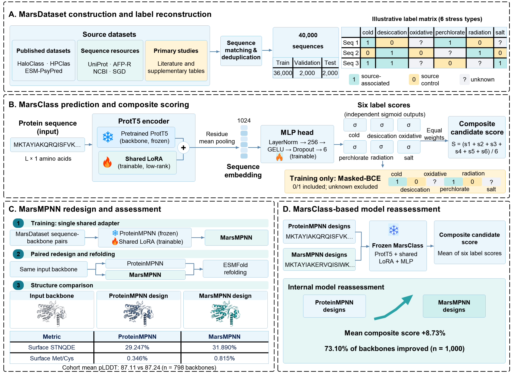

# MarsPro

MarsPro is a sequence-to-design framework for proteins associated with six
Mars-relevant stress categories: cold, desiccation, oxidative stress,
perchlorate-related conditions, radiation/DNA repair, and salt adaptation.



## Overview

MarsPro contains two connected components:

- **MarsClass** predicts six source-association scores from a protein sequence.
  It uses a ProtT5 encoder, one shared LoRA adapter, a multilabel head, and
  task-aware Masked-BCE training.
- **MarsMPNN** adapts ProteinMPNN with a shared LoRA adapter to redesign protein
  sequences on fixed backbones. A frozen MarsClass model provides an internal
  reassessment score for matched ProteinMPNN and MarsMPNN designs.

The six labels are broad source, family, or proteome associations. A positive
label does not mean that every sequence has experimentally demonstrated stress
tolerance. Each sequence-task cell is represented as `1`, `0`, or `unknown`;
unknown cells are excluded from Masked-BCE loss and known-cell evaluation.

## Data

- 40,000 accession-first records in the public repository; the public split
  tables do not contain raw sequence strings
- 36,000 training, 2,000 validation, and 2,000 locked-test records
- six multilabel stress categories with explicit unknown states
- ID50 cluster-aware splitting with no registered ID50 cluster shared across
  the fixed splits
- a 10,000-sequence structure-corpus index for MarsMPNN adaptation

`stage1_prediction/data/public_accession_only/` contains the public split
tables, sequence hashes, accessions, and retrieval fields. The complete
sequence tables are preserved in the dated local release package under
`full_training_tables/` for authorized internal training and are not uploaded
to this public repository.

PDB/CIF files and pretrained base-model weights are not included. Their
expected identifiers, inputs, and reconstruction metadata are retained.

## Verified results

- MarsClass validation macro AUPRC: **0.977087**
- MarsClass locked-test macro AUPRC: **0.975286**
- matched-seed redesign evaluation: 798 backbones, three seeds, and 2,394
  paired comparisons
- fixed-test redesign challenge: the mean six-output score increased from
  **0.61854** to **0.67251**, with **731/1,000** backbones improving

These values measure source-association prediction and computational design
consistency. They do not constitute experimental proof of stress tolerance.

## Repository layout

- `stage1_prediction/`: dataset, provenance, MarsClass code, checkpoint,
  locked-test evaluation, and ablations
- `stage2_design/`: structure index, MarsMPNN adapter, matched-seed results, and
  fixed-test redesign challenge
- `assets/figure_editable/`: author-provided editable figure projects used to
  regenerate the manuscript figures
- `docs/`: label semantics, claim boundaries, protocols, and reproducibility
  notes
- `scripts/`: release verification and source-holdout utilities
- `requirements/`: stage-specific Python dependencies

## Verification

```bash
python scripts/update_manifest.py
python scripts/verify_release.py
```

A valid release ends with `MarsPro public-release verification: PASS` and
reports zero bundled PDB/CIF structures.

## Licensing and release status

Code is provided under the MIT License. Author-created metadata and derived
results are provided under CC BY 4.0. Protein sequences and third-party source
content retain their upstream terms; see `DATA_LICENSE.md` and
`stage1_prediction/data/provenance/source_inventory_40k.csv`.

The code, author-created metadata, protocols, and derived results are public.
Sequence redistribution rights are not cleared uniformly across the 18 registered
scientific sources, so this repository is not a blanket redistribution grant.
The current source-by-source decision is in
`docs/SEQUENCE_REDISTRIBUTION_AUDIT_20260922.md`.
Users must consult
`stage1_prediction/data/provenance/source_inventory_40k.csv` and the upstream
terms before redistributing source-derived sequence content. The source-holdout
protocol and its task-level evaluability status are documented in
`docs/SOURCE_HOLDOUT_PROTOCOL.md` and
`docs/SOURCE_HOLDOUT_RESULTS_STATUS.md`; report-only fold counts are not model
results.
